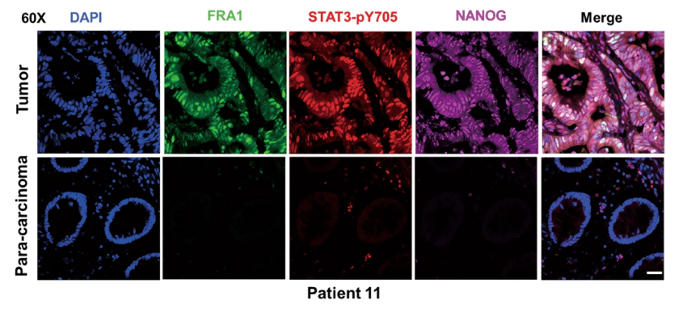

Colorectal cancer (CRC) has long been known for its tight association with chronic inflammation, thought to play a key role in tumor onset and malignant progression through the modulation of cancer stemness. However, the underlying molecular and cellular mechanisms are still largely elusive. Here we show that the IL-6/STAT3 inflammatory signaling axis induces the deacetylation of FRA1 at the Lys-116 residue located within its DNA-binding domain. The HDAC6 deacetylase underlies this key modification leading to the increase of FRA1 transcriptional activity, the subsequent transactivation of NANOG expression, and the acquisition of stem-like cellular features. As validated in a large (n = 123) CRC cohort, IL-6 secretion was invariably accompanied by increased FRA1 deacetylation at K116 and an overall increase in its protein levels, coincident with malignant progression and poor prognosis. Of note, combined treatment with the conventional cytotoxic drug 5-FU together with Tubastatin A, a HDAC6-specific inhibitor, resulted in a significant in vivo synergistic inhibitory effect on tumor growth through suppression of CRC stemness. Our results reveal a novel transcriptional and posttranslational regulatory cross-talk between inflammation and stemness signaling pathways that underlie self-renewal and maintenance of CRC stem cells and promote their malignant behavior. Combinatorial treatment aimed at the core regulatory mechanisms downstream of IL-6 may offer a novel promising approach for CRC treatment.

[Download Accepted Manuscript here](https://www.nature.com/articles/s41388-019-0763-0)

Recommended citation: Wang, T., Song, P., Zhong, T. et al. The inflammatory cytokine IL-6 induces FRA1 deacetylation promoting colorectal cancer stem-like properties. Oncogene 38, 4932–4947 (2019). https://doi.org/10.1038/s41388-019-0763-0
