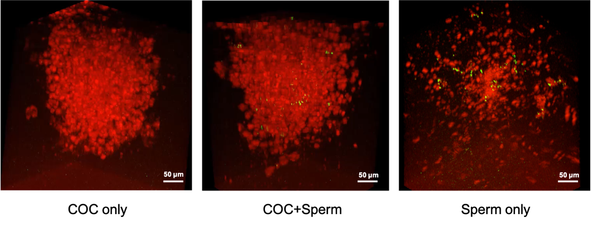

Fertilization is a critical reproductive step combining two gametes from parents, the egg and the sperm, to convey the genetic information to the next generation. This process is regulated in vivo by multiple factors influencing a selection of one sperm out of millions. However, due to the lack of suitable visualization approaches for in vivo fertilization processes, most of the current knowledge is derived from in vitro experiments, which cannot model the complexity of physiological states. The overall goal of this project is to capture the fertilization in vivo in a mouse model and to characterize the mechanisms regulating the dynamics of this process. Toward this goal, we recently established functional optical coherence tomography (OCT) integrated with intravital microscopy for live dynamic imaging of reproductive processes within the mouse fallopian tube. This method allowed for prolonged volumetric tracking of oocytes and embryos as well as individual spermatozoa at the site of fertilization based on their trajectories. However, visualizing the fertilization event remains a major challenge because the oocytes prior to fertilization are surrounded by a dense cloud of cumulus cells, forming the cumulus-oocyte-complex (COC), making direct sperm tracking through the optically dense cumulus matrix not feasible. This study presents the development of the speckle variance (SV) OCT analysis for volumetric tracking of sperm migration through the cumulus matrix toward the oocyte in vitro. Potentially, this method will be integrated with intravital OCT imaging to capture the process of mammalian fertilization in vivo.

[Download Accepted Manuscript here](https://www.spiedigitallibrary.org/conference-proceedings-of-spie/11959/1195902/Tracking-spermatozoa-movement-toward-the-egg-with-functional--optical/10.1117/12.2608265.short?SSO=1)

Recommended citation: Tian Xia, Kohei Umezu, Shang Wang, and Irina Larina "Tracking spermatozoa movement toward the egg with functional optical coherence tomography", Proc. SPIE 11959, Dynamics and Fluctuations in Biomedical Photonics XIX, 1195902 (2 March 2022); https://doi.org/10.1117/12.2608265

