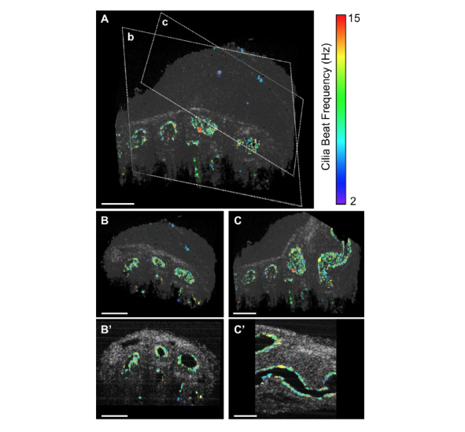

Spermatozoa transport within the male reproductive tract is a highly dynamic and biologically important reproductive event. However, due to the lack of live volumetric imaging technologies and quantitative measurements, there is little information on the dynamic aspect and regulation of this process. Here, we presented ex vivo dynamic volumetric imaging of the mouse testis, efferent duct, epididymis, and vas deferens at a micro-scale spatial resolution with optical coherence tomography (OCT). Micro computed tomography imaging is presented as a reference for the proposed OCT imaging. Application of functional OCT analysis allowed for 3D mapping of the cilia beat frequency in the efferent duct, which volumetrically visualized the spatial distribution of the ciliated cells and corresponding ciliary activities. Potentially these analyses could be expanded to in vivo settings through intravital approach. In summary, this study demonstrated that OCT has a great potential to investigate the microstructure and dynamics, such as cilia beating, muscle contractions, and sperm transport, within the male reproductive tract.

[Download Accepted Manuscript here](https://opg.optica.org/boe/fulltext.cfm?uri=boe-13-6-3672&id=476330)

Recommended citation: Kohei Umezu, Tian Xia, and Irina V. Larina, "Dynamic volumetric imaging and cilia beat mapping in the mouse male reproductive tract with optical coherence tomography," Biomed. Opt. Express 13, 3672-3684 (2022)
