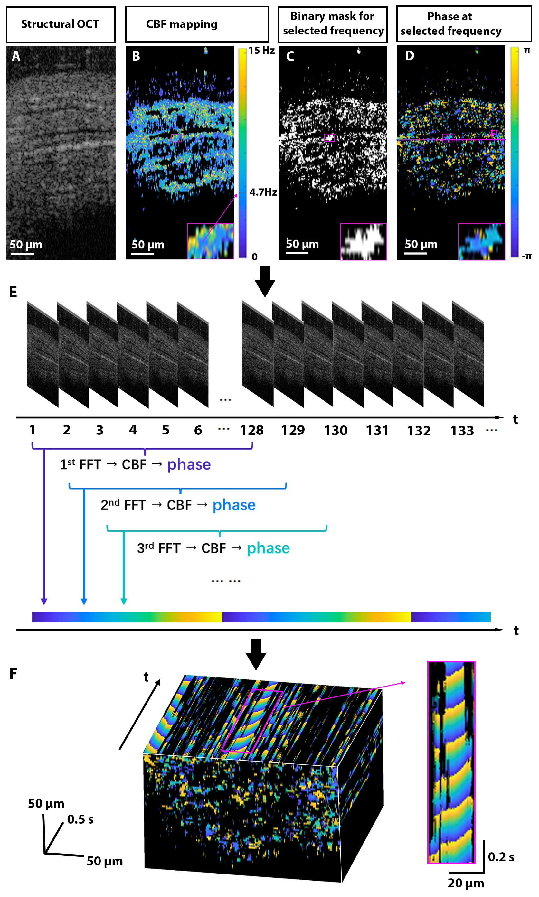

Motile cilia are dynamic hair-like structures that cover epithelial surfaces in multiple
organs. The periodic coordinated beating of cilia creates waves propagating along the surface,
called the metachronal waves, which transport fluids and mucus along the epithelium. Motile
ciliopathies arise due to disrupted coordinated cilia beating and are associated with serious
clinical complications including reproductive disorders. Despite the recognized clinical
significance, investigations of cilia dynamics are extremely limited. Here, we present the first
quantitative imaging of cilia metachronal wave volumetrically through tissue layers with
dynamic optical coherence tomography. Our method relies on spatiotemporal mapping of the
phase of intensity fluctuations in OCT images due to the ciliary beating. We validated our new
method ex vivo and implemented it in vivo to visualize cilia metachronal wave propagation
within the mouse fallopian tube. This new method can be extended to the assessment of
physiological cilia function and ciliary dyskinesias in various organ systems, contributing to
better management of pathologies associated with motile ciliopathies.

[Download Accepted Manuscript here](http://no1summer.github.io/files/OpticaAcceptedManuscript.pdf)

Recommended citation: Tian Xia, Kohei Umezu, Deirdre Scully, Shang Wang, and Irina Larina. &quot;In vivo volumetric depth-resolved imaging of cilia metachronal wave with dynamic optical coherence tomography.&quot; <i>Optica </i>. <i>10, 10</i>. <i>(2023)</i>. https://doi.org/10.1364/OPTICA.499927.
