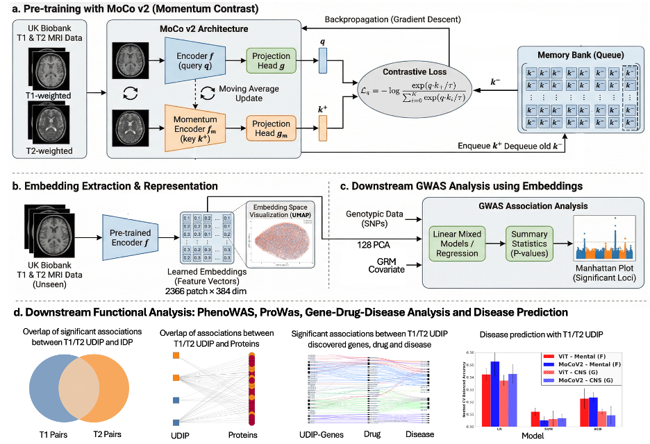

Magnetic resonance imaging (MRI)-derived phenotypes (IDP) has enabled the discovery of numerous genomic loci associated with brain structure and function. However, most existing IDPs and learned representations are derived from a single imaging modality, missing complementary information across modalities and potentially limiting the scope of genetic discovery. Here, we introduce a multimodal contrastive learning framework to derive heritable representations from paired T1- and T2-weighted MRIs. Unlike single-modality reconstruction-based models, we designed a momentum-based contrastive learning framework. As a result, our approach offers improved prediction of traditional IDPs, age, and brain disorders. Notably, genome-wide association studies (GWAS) of the learned representations reveal a substantially higher overlap of genetic loci across modalities, indicating improved alignment of their underlying genetic architecture. Analysis of the GWAS loci identified shared protein and drug targets, yielding meaningful biological insights. Overall, our framework learns shared representations across brain imaging modalities that exhibit anatomical and genetic coherence.

[Download Manuscript here](https://www.biorxiv.org/content/10.64898/2026.02.19.706893v1.full.pdf)
