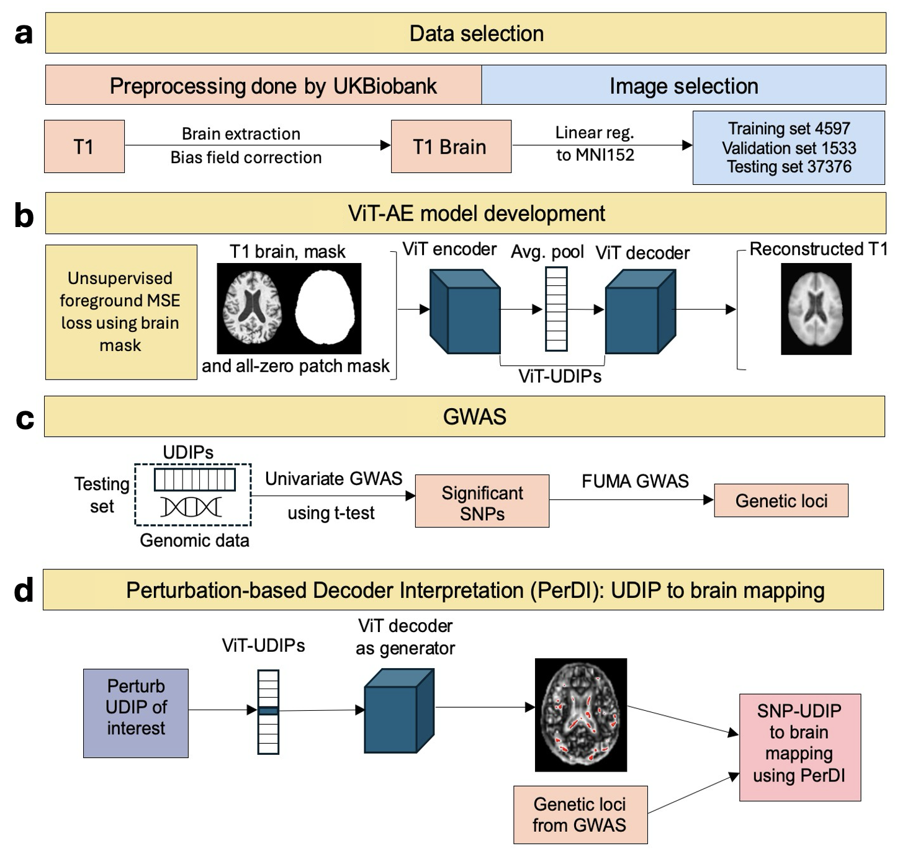

Linking genetic variation to human brain structure is a key step toward understanding the biological basis of cognition and disease. Progress in this area, however, has been limited by a major challenge: imaging features are often predefined, restricting the discovery of novel associations. Here, we present a framework that applies a Vision Transformer (ViT)-based autoencoder to derive 128-dimensional representations from T1-weighted brain MRI scans of 6,130 UK Biobank participants, which we call unsupervised learning derived image phenotypes from ViT (ViT-UDIP). These ViT-UDIP phenotypes are used in genome-wide association studies (GWAS) of 22,867 UK Biobank participants to identify significant genetic variants, which were further aggregated into genetic loci. The ViT-based approach uncovers a total of 63 loci and out of which 24 were not detected by the CNN-based method. Importantly, feature interpretation reveals that the model captured local as well as non-local anatomical patterns such as left-right hemisphere symmetry within brain MRI data by leveraging its attention mechanism and positional embeddings. This ability of capturing non-local patterns distinguishes the ViT from the previous CNN model. Together, these results demonstrate the value of transformer-based architectures in discovering novel and robust imaging phenotypes for genetic discovery.

[Download Manuscript here](https://www.nature.com/articles/s42003-026-10430-6)
